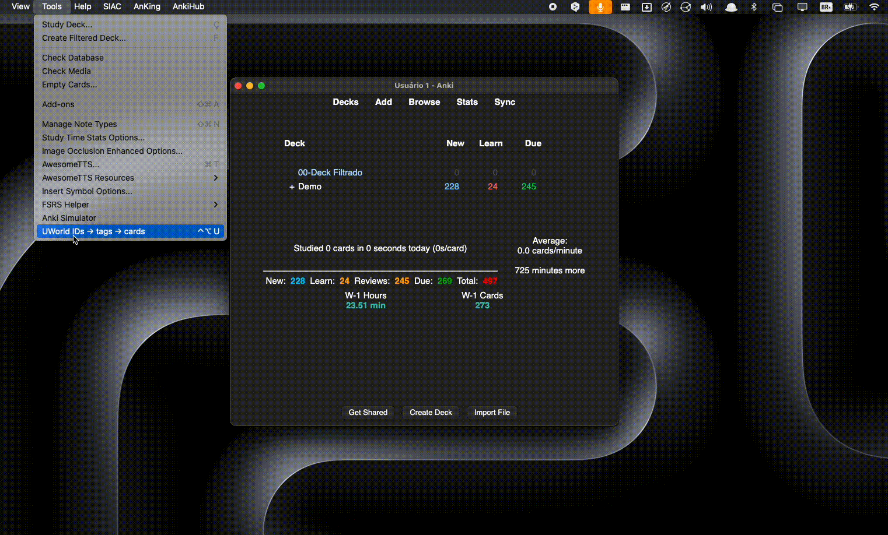

# UWorld IDs → tags → cards

  

Searching questions by UWorld IDs is repetitive because of Anki’s specific search syntax and the risk that some IDs may have no cards attached. This add-on takes your comma-separated set of IDs and returns the **correct Anki search syntax**, also telling you if there are any IDs **without cards** and which ones they are.

It looks up integer IDs (e.g., `1,3213,342435`) as **tags** in the pattern  
`#AK_Step1_v12::#UWorld::Step::<ID>` (or **V11**), counts **cards** found, lists **IDs without cards**, copies the **search syntax**, and opens the search in Anki’s **Browser** (automatically closing the add-on window).

---

## ✨ Features

- **Fast input**: paste IDs (comma-separated) and click **Run**  
- **Deck version**: V12 (default) or V11 — **persisted** across sessions  
- **Automatic counts**:  
  - Total IDs (input)  
  - Total cards found  
  - Total IDs **without** cards  
- **Ready-made search syntax**: `Copy “IDs (search syntax)”`  
- **Open in Browser**: runs the search and **closes** the add-on window  
- **Visual feedback**: **“Searching…”** → **“Done ✓”** on every run  
- **Configurable global shortcut** (Add-ons → Config)  
- Compatible with **Qt5/Qt6** and **Anki 25.x** (callback uses `Future`)  
- No external dependencies

---

## 🧭 How to Use

1. **Tools → UWorld IDs → tags → cards** (or use your **global shortcut**).  
2. **Paste** the IDs (e.g., `1,2312,3213,342435`).  
3. Choose the **version**: **V12** or **V11**.  
4. Click **Run**.  
5. Use **Copy “IDs (search syntax)”** to copy the query, or **Open in Browser** to run it directly in the Browser (the add-on window closes automatically).

> The search runs over the **entire collection**, with no deck filter.

---

## ⚙️ Configuration

- **Global shortcut**: in **Add-ons → (this add-on) → Config**, set your keys  
  (e.g., `Ctrl+Alt+U` on Windows/Linux; `Meta+Alt+U` on macOS).  
- **Default version (V12/V11)**: your choice is saved and reused next time.

---

## ✅ Compatibility

- Anki 2.1 (Qt5/Qt6), tested on **Anki 25.x**.  
- macOS/Windows/Linux.  
- No external libraries (plug-and-play).

---

## ❓ FAQ

**No cards found, but I’m sure I have the tags. Why?**  
• Make sure your tags exactly follow the pattern:  
`#AK_Step1_v12::#UWorld::Step::<ID>` (or `#AK_Step1_v11::#UWorld::Step::<ID>`).  
• Try copying the query via **Copy “IDs (search syntax)”** and running it in the Browser.

**Can I filter by deck?**  
Currently the search scans the entire collection.

**“Open in Browser” didn’t run the search — what now?**  
Open the Browser, paste the **search syntax** manually into the search field, and confirm.  
If it still fails, check the add-on console (Tools → Add-ons → View Console) and report the log.

---

## 🐞 Bug Reports / Feature Requests

Please open an issue including:
- OS + Anki version
- Steps to reproduce
- The exact IDs text you used
- Selected version (V12/V11)
- Console log (Tools → Add-ons → View Console)

---

## 📦 Changelog

**1.0.0**  
- Initial release: ID input, persistent V12/V11, counters, copy search syntax, open in Browser with auto-close, “Searching…/Done ✓” indicator, configurable global shortcut.

---

## 📝 License

AGPL-3.0 (or a license of your choice).
